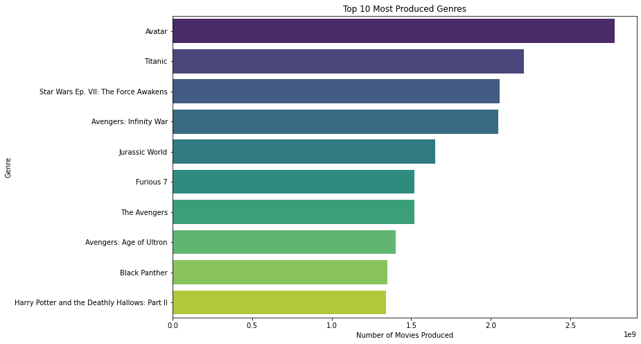
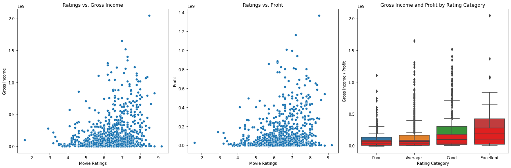
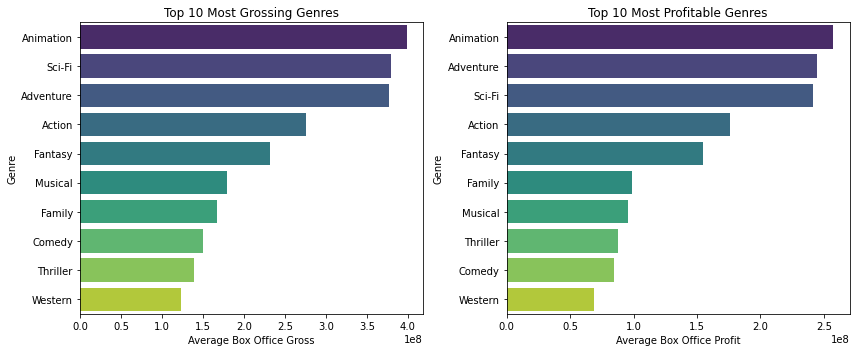

# Movie Analysis for Microsoft's New Movie Studio

## Overview
This project analyzes various movie datasets to provide actionable insights for Microsoft's new movie studio. The goal is to identify key factors that contribute to a film's success, helping Microsoft make data-driven decisions on what types of films to produce.

## Business Understanding
**Stakeholder:** Microsoft's new movie studio.

**Business Problem:** Microsoft wants to enter the movie production market but lacks experience in creating films. They need insights into the types of movies that are currently performing well at the box office to inform their production strategy.

**Key Business Questions:**
1. What genres are most profitable?
2. Which movie attributes correlate with higher box office returns?
3. How do critical and audience ratings impact a movie's financial success?

## Data Understanding
The analysis uses data from multiple sources:
- **Box Office Mojo (bom.movie_gross.csv):** Contains box office data.
- **IMDB (im.db):** SQLite database with detailed movie information and ratings.
- **Rotten Tomatoes (rt.movie_info.tsv, rt.reviews.tsv):** Provides movie information and reviews.
- **The Movie Database (tmdb.movies.csv):** Additional movie details.

## Data Analysis
The analysis includes the following key insights:

1. **Top 10 Grossing Movies**

2. **Distribution of Movie Ratings**

3. **Genres with Highest Average Box Office Gross**

## Recommendations
Based on the analysis, the following recommendations are made for Microsoft's new movie studio:
1. Focus on producing movies in genres with higher average box office gross.
2. Invest in films with high critic rating.
3. Prioritize films that tend to receive higher audience and critic ratings.

## Conclusion
This project provides a comprehensive analysis of movie data to guide Microsoft's new movie studio. By leveraging data-driven insights, Microsoft can strategically enter the movie production market and maximize their chances of success.

